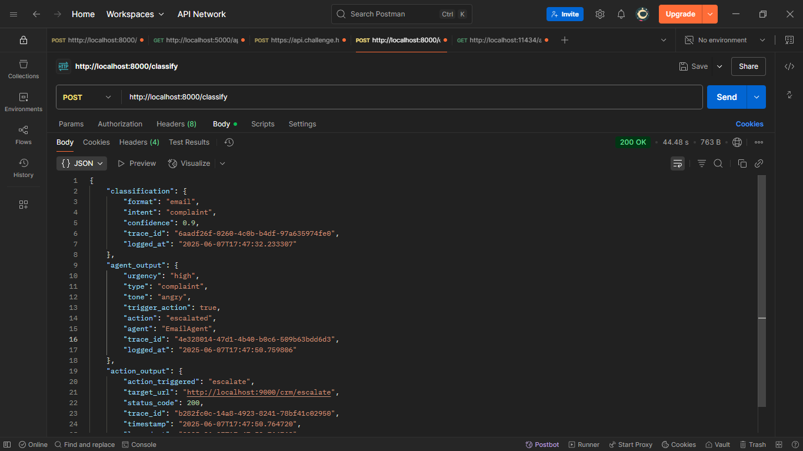
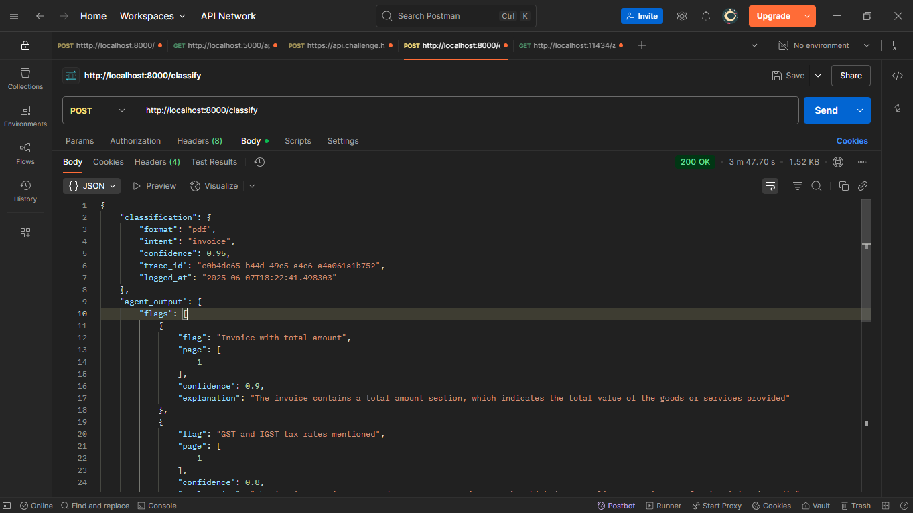

# 🤖 Multi-Format Autonomous AI System with Contextual Decisioning & Chained Actions

A smart, multi-agent system capable of autonomously processing Emails, PDFs, and JSON inputs to classify format and business intent, extract relevant fields, and dynamically trigger follow-up actions—while logging everything in a shared memory for audit and traceability.


## 🚀 Features

### 🔍 Classifier Agent

* Detects input format: `Email`, `PDF`, or `JSON`
* Identifies business intent: `RFQ`, `Complaint`, `Invoice`, `Regulation`, `Fraud Risk`
* Uses few-shot examples and schema matching
* Stores metadata in shared memory

### 📩 Email Agent

* Extracts sender, urgency, and request details
* Detects tone: `Polite`, `Escalation`, `Threatening`
* Triggers action:

  * Escalation → `POST /crm/escalate`
  * Routine → logs and closes

### 📦 JSON Agent

* Parses webhook-style JSON
* Validates schema (e.g., required fields, types)
* Flags anomalies and logs alerts to memory

### 📄 PDF Agent

* Parses PDF using `Tika` and `PyPDF2`
* Extracts invoice or policy information
* Triggers alert if:

  * Invoice total > 10,000
  * Policy mentions "GDPR", "FDA", etc.

### 🧠 Shared Memory Store

* Maintains:

  * Input metadata
  * Extracted fields
  * Chained actions taken
  * Agent decision traces
* Implemented using Redis

### 🔁 Action Router

* Routes outcomes to simulated REST endpoints:

  * `POST /crm/escalate`
  * `POST /risk_alert`
  * `POST /invoice/flag`


## 📂 Project Structure

```
multi_agent_system/
├─ api/
│  ├─ fake_crm.py
│  ├─ fake_invoice_api.py
│  ├─ fake_risk_api.py
│  ├─ main.py
│  └─ schemas.py
├─ classifier_agent/
│  └─ agent.py
├─ email_agent/
│  └─ agent.py
├─ json_agent/
│  └─ agent.py
├─ logs/
├─ memory/
│  └─ store.py
├─ pdf_agent/
│  └─ agent.py
├─ router/
│  └─ action_router.py
├─ samples/
│  ├─ emails/
│  │  ├─ email_sample1.txt
│  │  ├─ email_sample2.txt
│  │  ├─ email_sample3.txt
│  │  ├─ email_sample4.txt
│  │  └─ email_sample5.txt
│  ├─ json/
│  │  ├─ webhook1.json
│  │  ├─ webhook2.json
│  │  ├─ webhook3.json
│  │  ├─ webhook4.json
│  │  └─ webhook5.json
│  └─ pdf/
│     ├─ invoice_sample.pdf (private)
│     └─ invoice_sample2.pdf (private)
├─ tests/
│  ├─ test_classifier.py
│  ├─ test_email_agent.py
│  ├─ test_json_agent.py
│  └─ test_pdf_agent.py
├─ utils/
│  └─ llm_utils.py
├─ .gitignore
├─ docker-compose.yml
├─ Dockerfile
├─ LICENSE
├─ README.md
├─ requirements.txt
└─ supervisord.conf

```

---

## 💡 Example Workflow

1. User uploads an Email.
2. **Classifier Agent** → Detects: `Email` + `Complaint`
3. **Email Agent** → Tone: `Angry`, Urgency: `High`
4. **Action Router** → Calls `POST /crm/escalate`
5. **Memory** → Logs full trace for audit

---

## 🧪 Sample Inputs

* `email_sample1.txt`: Escalated complaint email
* `invoice_sample.pdf`: Invoice with line items
* `webhook1.json`: Webhook with anomalies

---

## 📸 Screenshots

| Email Classification            | PDF Invoice Parsing         | JSON Anomaly                  |
| ------------------------------- | --------------------------- | ----------------------------- |
|  |  |  |

---

## 🛠 Tech Stack

* **Python** + **FastAPI** for microservice architecture
* **LangChain** + **llama3** LLMs for intent classification and field extraction
* **PyPDF2** for PDF parsing
* **Redis** for shared memory
* **Docker** for containerization

---

## 🧰 How to Run

```bash

# 1. Clone the repository
git clone https://github.com/SagarMaddela/Multi-Format-Autonomous-AI-System.git
cd Multi-Format-Autonomous-AI-System

# 2. Install and run the LLaMA3 model using Ollama
# (Make sure Ollama is installed: https://ollama.com)
ollama pull llama3
ollama run llama3

```

---

## 🐳 Docker

```bash

docker compose up --build

```

## Postman or curl 

# Make a GET request 
GET/http://localhost:8000/ - Then u will get a response like this 

```bash 
{
    "message": "Classifier API is up and running"
}

```

# Make a POST request 
POST/http://localhost:8000/classify --> 
Go to body --> form-data --> Change the key to file and attach your sample file (email/pdf/json) as value , then u will get some response like this ( A sample response )

```bash 

{
    "classification": {
        "format": "email",
        "intent": "complaint",
        "confidence": 0.9,
        "trace_id": "6aadf26f-0260-4c0b-b4df-97a635974fe0",
        "logged_at": "2025-06-07T17:47:32.233307"
    },
    "agent_output": {
        "urgency": "high",
        "type": "complaint",
        "tone": "angry",
        "trigger_action": true,
        "action": "escalated",
        "agent": "EmailAgent",
        "trace_id": "4e328014-47d1-4b40-b0c6-509b63bdd6d3",
        "logged_at": "2025-06-07T17:47:50.759806"
    },
    "action_output": {
        "action_triggered": "escalate",
        "target_url": "http://localhost:9000/crm/escalate",
        "status_code": 200,
        "trace_id": "b282fc0c-14a8-4923-8241-78bf41c02950",
        "timestamp": "2025-06-07T17:47:50.764720",
        "logged_at": "2025-06-07T17:47:50.764763"
    }
}
```


## 🧠 Agent Flow Diagram


---

## 👨‍💻 Developed By
Sagar Maddela
venkatasagar.maddela2004@gmail.com

---

## 📄 License

This project is licensed under the MIT License.

---

## 🙌 Acknowledgements

Special thanks to Flowbit Private Limited for providing the challenge specification.

For questions or contributions, feel free to raise an issue or pull request!

All rights reserved © 2025
